<!-- 

This code is for gradio version: 5.44.1  
Project Space link in Hugging Face: https://huggingface.co/spaces/Hasan9519/Cap-Recognizer

 -->

# 🐦‍🔥 Recognizing Iconic Birds of Bangladesh 
Can classify 15 different type of birds found in Bangladesh. The types are following:

<!-- looks not good in preview but looks good in github -->
<!-- |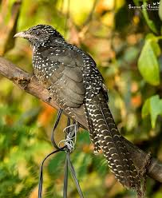|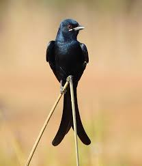|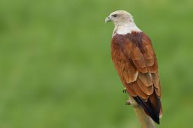|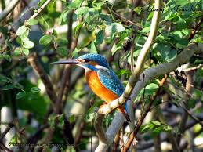|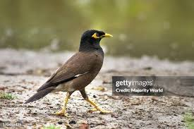|
|--------------------------|--------------------------|---------------------------|-------------------------------|-------------------------------|
|    Asian Koel (Kokil)    |  Black Drongo (Finge)    |Brahminy Kite (Shankh Chil)|Common Kingfisher (Machh Ranga)|     Common Myna (Shalik)      |

|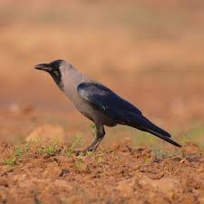||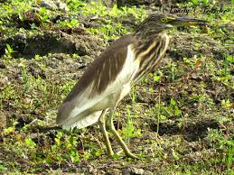|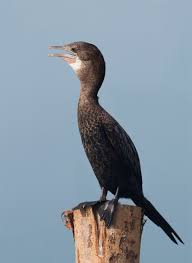|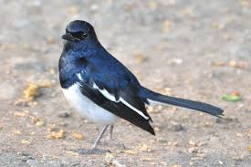|
|-----------------------|------------------------|------------------------------|-----------------------------|-------------------------------|
| House Crow (Pati Kak) | House Sparrow (Chorui) | Indian Pond Heron (Kani Bok) | Little Cormorant (Pankowri) | Oriental Magpie-Robin (Doel)  |

|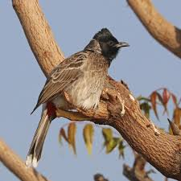|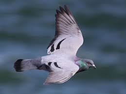|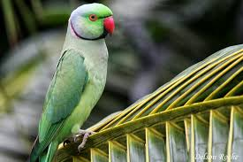|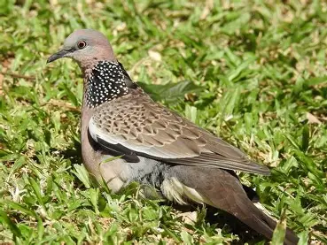|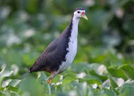|
|---------------------------|---------------------------|---------------------------------|---------------------------|-------------------------------|
|Red-vented Bulbul (Bulbul) | Rock Pigeon (Payerra)     |Rose-ringed Parakeet (Tiya Pakhi)|Spotted Dove (Telaghughu)  |White-breasted Waterhen (Dahuk)| -->

  

     
    Asian Koel (Kokil)
  

  

     
    Black Drongo (Finge)
  

  

     
    Brahminy Kite (Shankh Chil) 
  

  

     
    Common Kingfisher (Machh Ranga)
  

  

     
    Common Myna (Shalik)
  

 

<!-- uncomment if any theme are not being used -->
<!-- ### 🔍 Try It Yourself  
Upload an image and get predictions using our [Cap Recognizer Tool](./cap_recognizer.html). -->
<!-- --- -->

 