<!-- ---
title: Home
layout: page
--- -->

<!-- 

This code is for gradio version: 5.44.1  
Project Space link in Hugging Face: https://huggingface.co/spaces/Hasan9519/Cap-Recognizer

 -->

  <h1>🐦 Iconic Birds of Bangladesh</h1>
  
<em>Discover the beauty and diversity of our feathered friends</em>

  <a href="bd_iconic_bird-recognizer.html">
    <button>🔍 Try the Bird Recognizer</button>
  </a>

 

<!-- 

  

    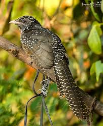 
    Asian Koel (Kokil)
  

  

    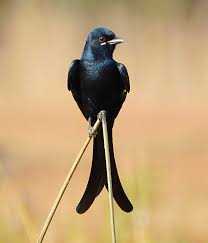 
    Black Drongo (Finge)
  

  

    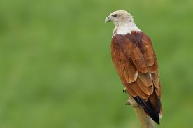 
    Brahminy Kite (Shankh Chil) 
  

  

  

    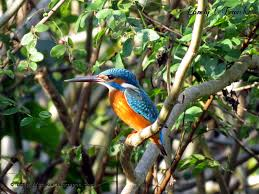 
    Common Kingfisher (Machh Ranga)
  

  

    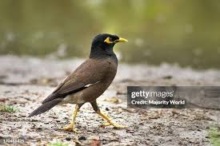 
    Common Myna (Shalik)
  

  

    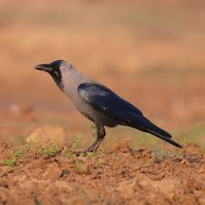 
    House Crow (Pati Kak)
  

  

  

    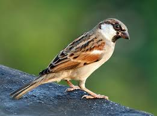 
    House Sparrow (Chorui)
  

  

    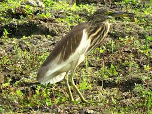 
    BIndian Pond Heron (Kani Bok)
  

  

    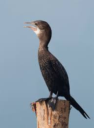 
    Little Cormorant (Pankowri)
  

  

  

    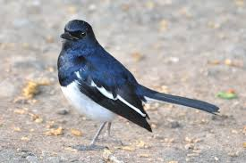 
    Oriental Magpie-Robin (Doel)
  

  

    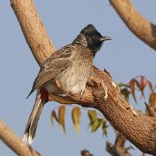 
    Red-vented Bulbul (Bulbul)
  

  

    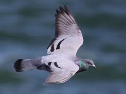 
    Rock Pigeon (Payerra)
  

  

  

    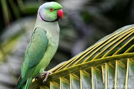 
    Rose-ringed Parakeet (Tiya Pakhi)
  

  

    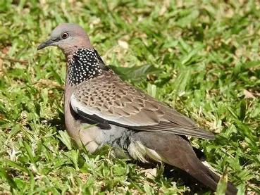 
    Spotted Dove (Telaghughu)
  

  

    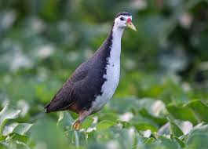 
    White-breasted Waterhen (Dahuk)
  

   -->

<!-- uncomment if any theme are not being used -->
<!-- ### 🔍 Try It Yourself  
Upload an image and get predictions using our [Cap Recognizer Tool](./cap_recognizer.html). -->
<!-- --- -->

<table>
  <tr>
    <td>
<strong>Asian Koel (Kokil):</strong> Known for its loud, resonant calls during the breeding season, the male Asian Koel is a glossy black cuckoo with crimson eyes. The female is dark brown with white spots.
</td>
    <td>
<strong>Black Drongo (Finge):</strong> This insectivorous bird is known for its glossy black plumage, forked tail, aggressive and fearless nature. It is a familiar sight perched on bare branches or wires in open countryside.
</td>
    <td>
<strong>Brahminy Kite (Shankh Chil):</strong> A distinctive bird of prey with a contrasting chestnut body and a striking white head and breast. It can often be seen soaring over coasts and wetlands.
</td>
  </tr>
  <!-- Repeat similar <tr> blocks for the remaining birds -->
</table>

<footer>
  Made with ❤️ by Hasan · Powered by GitHub Pages
</footer>